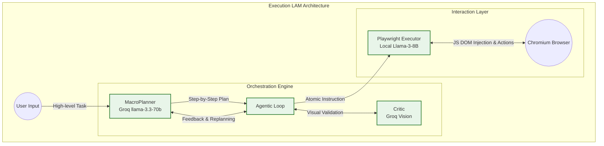
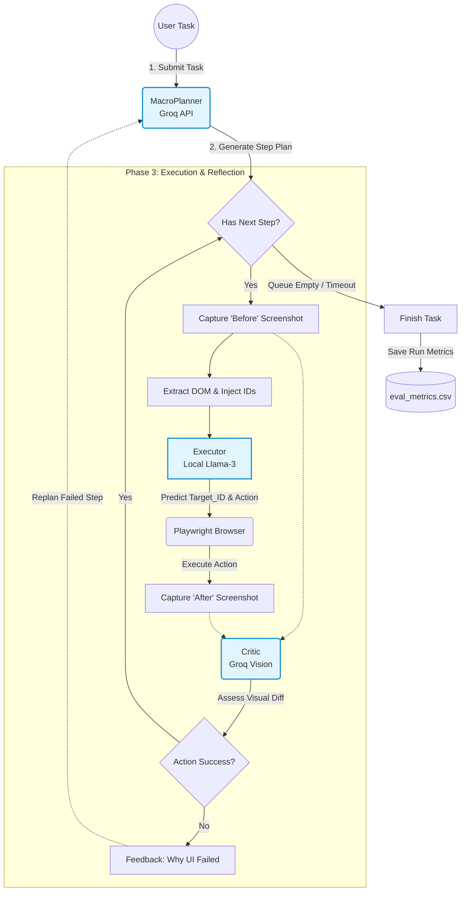

# Execution LAM: Architecture and Flow

## Overall Architecture
The Execution LAM uses a **DOM-based, Self-Reflecting Agentic Architecture**. Instead of relying purely on screen pixels to guess where to click (like CogAgent or PyAutoGUI), this system dynamically injects Javascript to extract interactable DOM elements, parses them with a tuned text model, and uses computer vision to double-check its own work.

The system is composed of four main pillars:

1. **MacroPlanner (`macro_planner.py`)**: The brain responsible for high-level reasoning. It uses an ultra-fast, large language model (via Groq API: `llama-3.3-70b-versatile`) to decompose a complex natural language task into a sequence of atomic, easily executable browser actions.
2. **Executor (`executor.py`)**: The muscle of the system. It controls a Playwright browser instance. It relies on a "Fast-Path/Slow-Path" architecture:
   - *Fast-Path*: It uses semantic heuristics and regex to attempt standard actions locally (like typing, going to a URL directly, or pressing Enter). 
   - *Slow-Path*: If an action is complex, it injects Javascript to strip the current webpage DOM down into a lightweight text tree, appends custom tracking IDs (`data-lam-id`) to interactable elements, and prompts a locally running Llama-3-8B model (via Ollama Cloudflare tunnel) to predict the exact `Target_ID` and Action.
3. **Critic (`critic.py`)**: The quality-assurance module. It utilizes a multi-modal vision model (e.g., `llama-3.2-11b-vision-preview` via Groq) to look at "Before" and "After" screenshots of the browser. It judges whether the UI actually changed in the intended way to confirm success.
4. **Agentic Loop (`agentic_loop.py`)**: The central orchestrator that manages timeouts, error handling, tracking metrics, and connecting the Planner, Executor, and Critic together.

---

## Phase-wise Working of the Model (The Agentic Loop)

The working of the model happens in an event loop divided into four distinct phases:

### 1. Initialization Phase
The script `agentic_loop.py` launches an asynchronous `Playwright` Chromium session in a visible headed state so the user can watch. It initializes the Planner (Groq Cloud), Critic (Groq Vision), and Executor (Local Ollama), routing the browser to an initial starting URL (like Google.com) and waiting for the page network to settle.

### 2. Planning Phase
The user passes a task (e.g. *"Search Google for cats and click the first video"*). The `MacroPlanner` intercepts this and writes a strict, numbered instruction plan. 
*Example:* 
1. Navigate to https://www.google.com
2. Type 'cats' into the search bar
3. Press Enter
4. Click on the first video result

### 3. Execution & Reflection Phase (The Loop)
For every step generated in the Planning Phase, the system executes the following:
* **Step A (Pre-Observation):** Playwright takes a `before_screenshot`.
* **Step B (Inference & Execution):** 
  The `Executor` attempts to carry out the instruction. It first tries built-in regex tools. If none match, it sends the truncated DOM tree text to the local Llama model to get a structured JSON-like response: `Action`, `Target_ID`, `Value`. It uses that ID to execute a Playwright `element.click()` or `element.fill()`.
* **Step C (Post-Observation):** Once the action finishes, the script waits for the network to idle and captures an `after_screenshot`.
* **Step D (Critic Reflection):** Both screenshots and the instruction are sent to the `AgenticCritic`. 
  - **If Approved (Success):** The agent moves to the next instruction on the list.
  - **If Denied (Failure):** The critic generates a visual reason why it failed (e.g., *"Menu didn't open"*). The `MacroPlanner` is re-invoked with this feedback to generate a **Revised Step**, swapping it into the queue to try and recover the session. 
  - *Note: If an action fails more than 3 times, the system auto-skips the step to avoid getting stuck in infinite loops.*

### 4. Termination & Telemetry Phase
Once the queue is empty (or the max iteration limit of 20 is hit), the loop shuts down. A telemetry row is written to `eval_metrics.csv` calculating the Task Success Rate (TSR), Step Success Rate (SSR), retry rates, and total completion time for analytic auditing.

---

## Detailed Project Summary

The "Execution LAM" project is an advanced, robust, and optimized web-automation agent designed to navigate the internet autonomously with high reliability and low latency.

Historically, UI automation models relied heavily on pixel coordinates, which are prone to failures when screen resolutions change, elements shift, or UI layouts undergo A/B testing. This project transitions away from that fragile pixel-based architecture into a **DOM-centric execution framework**. By assigning custom tracking IDs (`data-lam-id`) dynamically to interactable HTML elements via Javascript, the LLM only ever has to figure out which ID to interact with. Playwright then natively clicks the matched ID.

To ensure speed and drastically reduce costs, the architecture is deliberately fragmented:
- **Heuristics First:** It doesn't use an LLM if it doesn't have to. The `Executor` has native logic bindings to detect basic inputs (e.g., if the user says "Press Escape", it just triggers the Playwright keypress without making an expensive LLM network call).
- **Segmented Intelligence:** Expensive, high-parameter models (`Llama-3 70B`) are used only once at the beginning for complex macro-reasoning (generating the plan). A smaller, cheaper, fine-tuned `8B` model handles the repetitive task of reading the messy DOM to find a target.
- **Fail-Safe Mechanism:** The biggest leap forward in this framework is the inclusion of the visual `Critic`. Standard web scrapers and macro bots fail silently if a page hasn't loaded fully or an element is obstructed. By validating every single move with a Vision LLM looking at actual screenshots of the local browser, the system becomes "self-healing," capable of recognizing when an action failed and intelligently re-routing its execution strategy on the fly.
