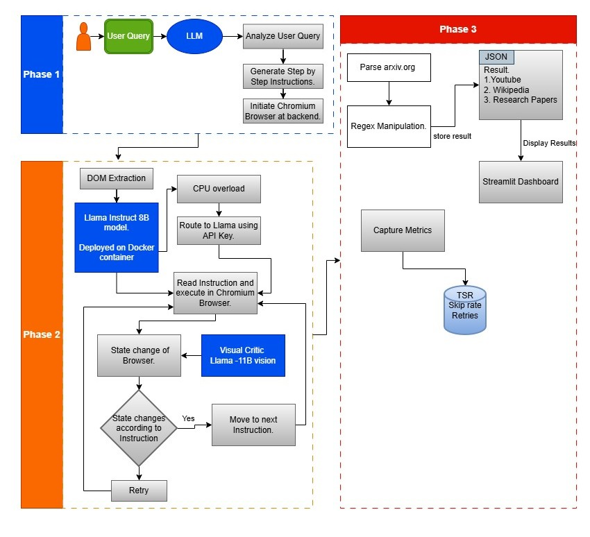

# Large Action Model (LAM) for Education and Research

A DOM-driven, LLM-orchestrated UI Automation Agent tailored for complex web tasks, educational research, and UI task completion. The system plans, executes, reflects, and self-heals in real-time.



## 📋 Table of Contents
- [Project Overview](#project-overview)
- [System Architecture](#system-architecture)
- [Key Features](#key-features)
- [File Organization](#file-organization)
- [Prerequisites](#prerequisites)
- [Installation & Setup](#installation--setup)
- [Running the Project](#running-the-project)
- [How It Works](#how-it-works)
- [License](#license)

## 🎯 Project Overview
This project is an advanced Large Action Model (LAM) execution engine. By converting natural language into a structured macro plan, the agent autonomously executes UI interactions (such as type, click, scroll) using a local Llama model combined with a vision-based Critic model.
The engine includes a Streamlit UI dashboard for real-time visualization of the automated workflow and underlying execution logs.

## 🏗 System Architecture

The core agentic loop relies on a multi-modal setup, segregating logic into distinct components:
- **MacroPlanner:** Decomposes user requests into actionable browser steps (powered by Groq `llama-3.3-70b-versatile`).
- **PlaywrightExecutor:** Extracts DOM using semantic locators and falls back to inference via a Local Llama-3 model.
- **AgenticCritic:** Visual evaluator that verifies state changes using a Vision API (Groq `llama-3.2-11b-vision-preview`).
- **Streamlit Dashboard (app.py):** The primary UI controlling the runtime flow.

For a deeper dive, check out the [System Architecture Document](SYSTEM_ARCHITECTURE.md).

## ✨ Key Features
- **Real-Time UI Task Execution:** Visually interacts with the browser on your behalf.
- **Self-Healing Agentic Loop:** On task failure, the MacroPlanner dynamically replans and retries the target step.
- **Critic-in-the-Loop:** Captures before/after screenshots and evaluates success via Vision LLM.
- **DOM Injection Locators:** Injects unique `data-lam-id`s to visible elements, bypassing brittle CSS Selectors.
- **Persistent Evaluation Metrics:** Tracks task completion, execution time, and retry rates seamlessly in `eval_metrics.csv`.
- **Bot-Detection Evasion:** Uses `curl_cffi` to mimic Chrome TLS fingerprints effectively.

## 📂 File Organization
```
├── app.py                  # Streamlit frontend — user entry point
├── agentic_loop.py         # Master orchestrator — execution engine
├── macro_planner.py        # LLM-based task decomposer (Groq)
├── executor.py             # DOM extractor + action executor (Playwright + Ollama)
├── critic.py               # Visual action evaluator (Groq Vision)
├── config.py               # Centralized config (API keys, tunnel URL)
├── summarizer.py           # Content summarization logic
├── eval_metrics.csv        # Persisted run-level evaluation metrics
├── lam_execution.log       # Historical execution log
├── lam_dom_execution.log   # Execution log (live-streamed to Streamlit)
├── .env.example            # Environment variables template
├── .gitignore              # Files to ignore in git repository
├── README.md               # Project documentation
├── SYSTEM_ARCHITECTURE.md  # Detailed architecture documentation
├── ARCHITECTURE.md         # Secondary architecture guide
└── states/                 # Directory holding before/after screenshots per step
```

## ⚙️ Prerequisites
Before running the agent, you need:
- Python 3.9 or higher
- [Playwright](https://playwright.dev/python/) installed
- Valid **Groq API Key**
- A locally or remotely hosted **Ollama server** (with Llama-3 model).

## 🚀 Installation & Setup

1. **Clone the repository:**
   ```bash
   git clone https://github.com/NaveenHuggi/Large-Action-Model-for-Education.git
   cd Large-Action-Model-for-Education
   ```

2. **Install necessary dependencies:**
   ```bash
   pip install -r requirements.txt
   ```
   *(Create a requirements.txt if not present by extracting imports: playwright, streamlit, curl_cffi, etc.)*

3. **Install Playwright Browsers:**
   ```bash
   playwright install chromium
   ```

4. **Environment Configuration:**
   Copy the `.env.example` file to create your own local `.env` and fill in the credentials:
   ```bash
   cp .env.example .env
   ```
   Provide your `GROQ_API_KEY` within the `.env` file. Do not commit or share this file publicly!

## 💻 Running the Project

To launch the LAM execution engine, simply run the Streamlit dashboard:

```bash
streamlit run app.py
```

### From the Dashboard:
1. **Enter Task:** Provide a natural language objective (e.g., "Search YouTube for PyTorch tutorial").
2. **Start Agent:** Click the 'Start Agent' button to begin the job.
3. The backend spins up the chromium browser using Playwright.
4. **Live Logs:** View the task iterations, step verifications, and execution logs in real-time via the terminal output panel displayed in Streamlit.
5. Provide the `--keep-alive` configuration to view the browser post-execution manually.

## 🧠 How It Works
1. **Macro Planning:** The user task is processed by a 8B parameter LLM which defines a granular action plan.
2. **Browser Initialization:** Chromium launches with `headless=False` for full transparency.
3. **Execution Loop:**
   - **Capture Before state** (screenshot).
   - Evaluate instruction (prioritize URL navigations & Semantic Locators).
   - Inject `data-lam-id`s into the DOM and ask Local LLM for logical interactions.
   - Execute DOM actions natively via Playwright.
   - **Capture After state**.
   - Send snapshots to Vision LLM (Critic). Retry dynamically on explicit failures.
4. **Metrics:** Output runtime behaviors to `eval_metrics.csv` automatically.

## 📜 License
This project is licensed under the MIT License.
